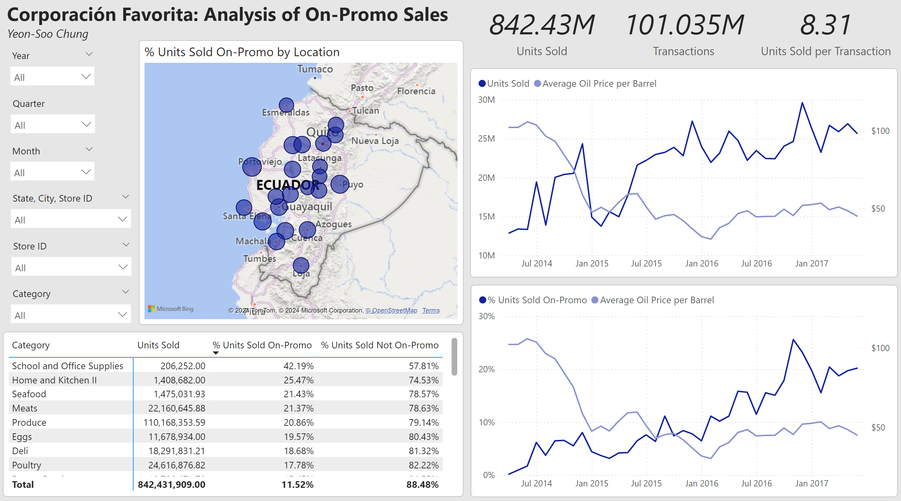
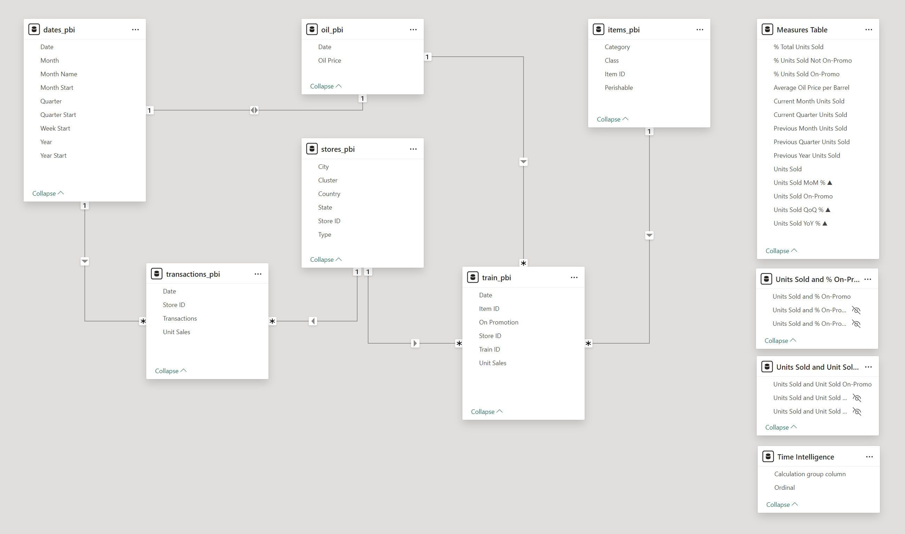

# Corporación Favorita
## Analysis of on-promo sales at a large Ecuadorian grocery chain.

Corporación Favorita provided sales data ranging from 2013 to 2017. The data includes information on stores, items, number of units sold, number of items sold on promo, number of transactions at specifc store/date combos (but no transaction data at the itemized level), and oil prices, which have a significant impact on Ecuador's economy. The "On Promotion" data is given as True/False, and I filtered out its null values, which truncated the data set's date range to Apr. 2014 - Aug. 2017.

In this project, I analyzed the data pertaining to items sold on promo. I developed a Power BI dashboard that enables the user to view units sold over time and % of units sold on-promo over time. The dashboard's interactive features allow the user to analyze these trends based on item category, location, different time granularities, and comparing with oil prices.

I chose DuckDB as my database because, with Python, I was able to run SQL queries and code in Pandas to transform the data sets and create my data model for Power BI. One of my processing stages involved imputing missing values in the oil prices data table with the average of the nearest available values (nearest based on dates), and I decided that Pandas was the best tool to perform this.

DAX queries were implemented in Power BI to create aggregate measures or metrics.

Data source: https://www.kaggle.com/competitions/favorita-grocery-sales-forecasting/data

## Summary of Findings

The total number of units sold across all stores averaged at about 400,000 units from April 2014 to June 2015. After this June 2015, unit sales increased to a higher average of about 800,000 units. This shift coincides with oil prices decreasing and staying at a lower price range than 2014 levels.

Overall trends demonstrate that the lower the price of oil, the higher the unit sales as well as the share of units sold that were on promo. Ecuador is a petrostate, so if oil prices decrease, consumers will be less likely to spend money, which is why we see more items going on promotion and sold as such.

**School and Office Supplies (SOS)** sell at the highest percentage of units on promo overall (i.e., entire data set), driven by their sales in Q2 and Q3 over every year in the data set (unsurprisingly, SOS sales spike at certain points of the year). During Q1, Meats, Produce, and Eggs have the highest percentage of unit sales from items on promo. In Q4, the leading categories are Produce, Eggs, and “Home and Kitchen II”. There is some variation at the state level, but in most states, **SOS** items top the list followed by food-based categories. The rest of this section summarizes the trends in the next top categories based on overall % units sold on-promo.

**Meats:** Overall, unit sales of meat products increased steadily over the data set’s time frame. However, their % units sold on-promo stayed mostly consistent. There is a sharp increase at the start and end of the data set, but this could be due to less data being provided at those dates.

**Produce:** Apart from a couple sharp dips, units sales and % units sold on-promo stay relatively consistent throughout the data set. The second sharp dip, starting at Jan. 2015, lasts for five months and coincides with a slide in oil prices that stabilize in those five months. More items were likely promoted to bring sales back up, as oil prices did not climb back to pre-fall 2014 levels.

**Eggs:** There is a visually discernible correlation between egg sales and oil prices, as well as between % units of eggs sold on-promo and oil prices, starting from Oct. 2014. There are sharp spikes at Oct.-Dec. 2016 and at May/June 2017. Unlike the general trend seen in the overall data, egg sales have a more direct correlation with oil prices. 

**Home and Kitchen II:** Unit sales and % unit sales on-promo generally increased as oil prices decreased and remained at low prices after Jan. 2015, indicating promotional reactions to oil prices.
 
## ELT Steps and Data Model

**cf_db.py:**  This script creates my DuckDB database.

**ingest_data_to_db.py:** After downloading the data set from Kaggle, I ingest the csv files into the database.

**impute_oil_table.py:** The raw oil table has columns for dates and oil prices (USD per barrel). Some prices have null values, and there are some dates that are skipped. This script does the following:
- Creates a date table for the range of my data set (Apr. 1, 2014 to Aug. 15, 2017).
- Join the table of continuous dates with the oil table.
- Imputes the null prices with the average of the nearest (in terms of dates) available prices before and after the missing value(s). If there are consecutive missing values, they are all imputed with the same average value. If there are (consecutive) missing values at the beginning of the table, they are imputed with the nearest available value. Likewise for for (consecutive) missing values at the end of the table.
- The processed oil table is saved as a new table in the database, with renamed columns.

**test_imputer.py:** Performs unit tests on the imputer function in **impute_oil_table.py**.

**create_data_model.py:** Sets up the rest of the data model:
- Performed a join operation to add a column for unit sales to the transactions data and created a view with the new table.
- Truncated the train table to only include dates for which "onpromotion" data is not null; and converted the "onpromotion" values of True/False to Yes/No.
- Renamed columns for all tables and views.
- I create a view for transactions in order to keep the original transactions table. I kept the other tables as tables because I did not create new columns with them - just made changes like imputations and renaming.

After importing my tables/view to Power BI, my data model looks like below:

