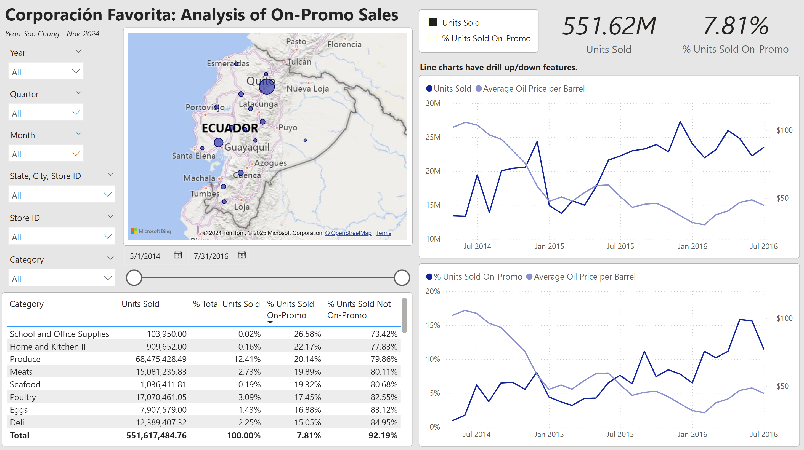
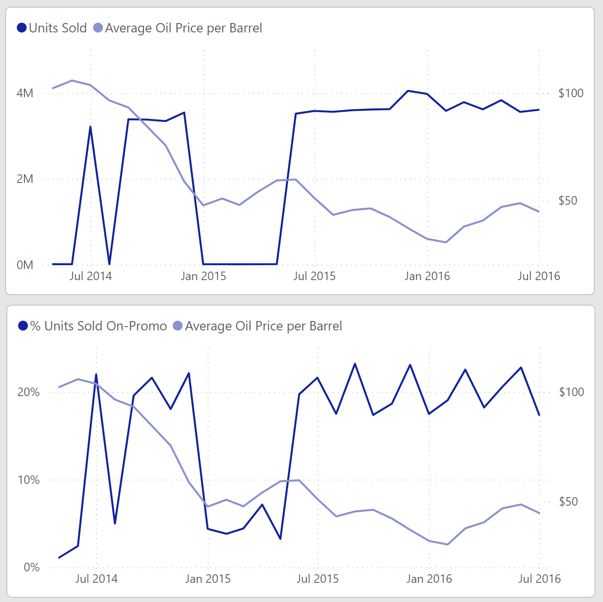
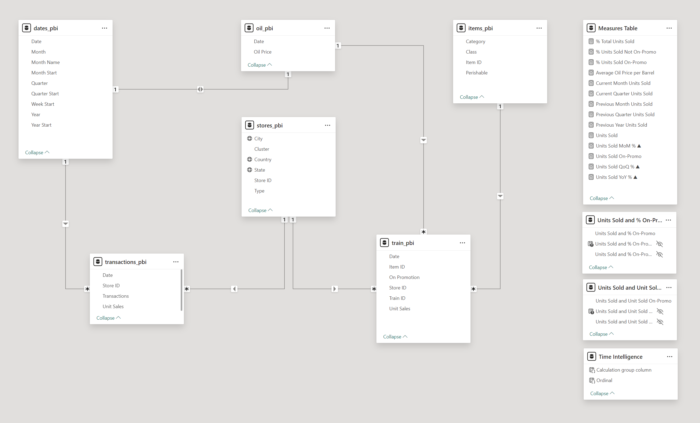

# Corporación Favorita: Analysis of On-Promo Sales at a Large Ecuadorian Grocery Chain

Corporación Favorita provided sales data ranging from 2013 to 2017. The data includes information on stores, items, number of units sold, items sold on promo, number of transactions at specific store/date pairs (no transaction data at the itemized level), and oil prices, which have a significant impact on Ecuador's economy. The "On Promotion" data is given as True/False, and I filtered out its null values, which truncated the data set's date range to Apr. 2014 - Aug. 2017.

In this project, I analyzed the data pertaining to items sold on promo. I developed a Power BI dashboard that enables the user to view units sold over time and % of units sold on-promo over time. The dashboard's interactive features allow the user to analyze these trends based on item category, location, different time granularities (month, quarter, and year), and comparison with oil prices. The second page of my dashboard quantifies the visual trends displayed in the first page.

I chose DuckDB as my database because, with Python, I was able to run SQL queries and code in Pandas to transform the data sets and create my data model for Power BI. One of my processing stages involved imputing missing values in the oil prices data table with the average of the nearest available values (nearest based on dates), and I decided that Pandas was the best tool to perform this with.

DAX queries were implemented in Power BI to create aggregate measures or metrics.

Data source: https://www.kaggle.com/competitions/favorita-grocery-sales-forecasting/data

## Summary of Findings

I decided to focus on two metrics in this analysis of on-promo sales: units sold and % units sold on-promo. Total unit sales reflect the overall health of the company, and % units sold on-promo indicate the proportion of items on promotion. I am interested in how these two metrics trend over time and with oil prices.

The total number of units sold across all stores averaged at about 400,000 units from April 2014 to June 2015. After this June 2015, unit sales increased to a higher average of about 800,000 units. This shift coincides with oil prices decreasing and staying at a lower price range than 2014 levels.

Note that these line charts can be drilled up/down to aggregate the measures by week, month, and year. The images in this document show the trends aggregated by month.

Overall trends demonstrate that the lower the price of oil, the higher the unit sales as well as the share of units sold that were on promo. Ecuador is a petrostate, so if oil prices decrease, then consumers will be less likely to spend money, which is why we see more items going on promotion and sold as such.

Trends of unit sales at the state level generally mirrored the overall trend. The state of Santa Elena is an exception due to a substantial dip in sales between Apr. 2016 and Oct. 2016. By contrast, its % unit sales on-promo saw a spike from Jul. 2016 to Nov. 2016, indicating that customers were particularly focused on purchasing items on promotion during this time period. Another exception is the trend in % unit sales on-promo in the state of Manabi. In May 2016, 99.92% of units sold were on-promo. This coincides with a major earthquake that occurred in this state on Apr. 16, 2016.

### Top Selling Items on-Promo

- **School and Office Supplies (SOS)** sell at the highest percentage of units on promo overall (i.e., entire data set), driven by their sales in Q2 and Q3 over every year in the data set (In Ecuador, schools in the coastal regions start the school year in April, and those in the Andean regions start in September). The steep drop in oil prices in Q2 of 2015 prompted Ecuadorians to withhold purchase of SOS items, indicated by the absence of a peak for the April 2015 back-to-school season.

During Q1, Meats, Produce, and Eggs have the highest percentage of unit sales from items on promo. In Q4, the leading categories are Produce, Eggs, and “Home and Kitchen II”. There is some variation at the state level, but in most states, SOS items top the list followed by food-based categories.

- **Meats:** Overall, unit sales of meat products increased steadily over the data set’s time frame. However, their % units sold on-promo stayed mostly consistent, except at the end of the data set.

- **Produce:** Apart from an initial low and two sharp dips, unit sales and % units sold on-promo stay relatively consistent throughout the data set. The second sharp dip, starting at Jan. 2015, lasts for five months and coincides with a slide in oil prices that stabilize in those five months. Along with the necessity of buying produce, more of these items must have been promoted to bring profits back up, as oil prices did not climb back to their 2014 levels.

- **Eggs:** There is a visually discernible correlation between egg sales and oil prices, as well as between % units of eggs sold on-promo and oil prices, starting from Oct. 2014. There are sharp spikes at Oct.-Dec. 2016 and at May/June 2017, part of an overall increase in egg sales (total and on-promo) compared to Jan. 2015-Jan. 2016, despite oil prices being consistently low throughout. This indicates increased promotional sales of eggs after Sep. 2016 and suggests a larger incorporation of eggs into the meals of Ecuadorian homes as a form of austerity.

- **Home and Kitchen II:** Unit sales generally increased as oil prices decreased after Jan. 2015, followed by stability in sales after Jan. 2016 as oil prices remained at low levels. Before 2016, however, there was spike in units sold in Oct. 2015, and there were two spikes in % units sold (in June 2015 and Oct. 2015). The spikes suggest items were promoted to boost sales after the oil prices dropped, resulting in higher levels of sales than 2014 (before oil prices fell) to bring back profitability. Increase in these items as well as food items compared to 2014 sales indicate more Ecuadorians were cooking at home.

 
## ELT Steps and Data Model

- **cf_db.py:**  This script creates my DuckDB database.

- **ingest_data_to_db.py:** After downloading the data set from Kaggle, I ingest the csv files into the database.

- **impute_oil_table.py:** The raw oil table has columns for dates and oil prices (USD per barrel). Some prices have null values, and there are some dates that are skipped. This script does the following:
  - Creates a date table for the range of my data set (Apr. 1, 2014 to Aug. 15, 2017).
  - Join the table of continuous dates with the oil table.
  - Imputes the null prices with the average of the nearest (in terms of dates) available prices before and after the missing value(s). If there are consecutive missing values, they are all imputed with the same average value. If there are (consecutive) missing values at the beginning of the table, they are imputed with the nearest available value. Likewise for for (consecutive) missing values at the end of the table.
  - The processed oil table is saved as a new table in the database, with renamed columns.

- **test_imputer.py:** Performs unit tests on the imputer function in **impute_oil_table.py**.

- **create_data_model.py:** Sets up the rest of the data model:
  - Performed a join operation to add a column for unit sales to the transactions data and created a view with the new table. I ended up not using any transactions data in my dashboard because of the unavailability of detailed information. More insights could be gained if, for example, transactions data at the item or category level were available.
  - Truncated the train table to only include dates for which "onpromotion" data is not null; and converted the "onpromotion" values of True/False to Yes/No.
  - Renamed columns for all tables and views.
  - I create a view for transactions in order to keep the original transactions table. I kept the other tables as tables because I did not create new columns with them - just made changes like imputations and renaming.

After importing my tables/view to Power BI, my data model looks like below:

